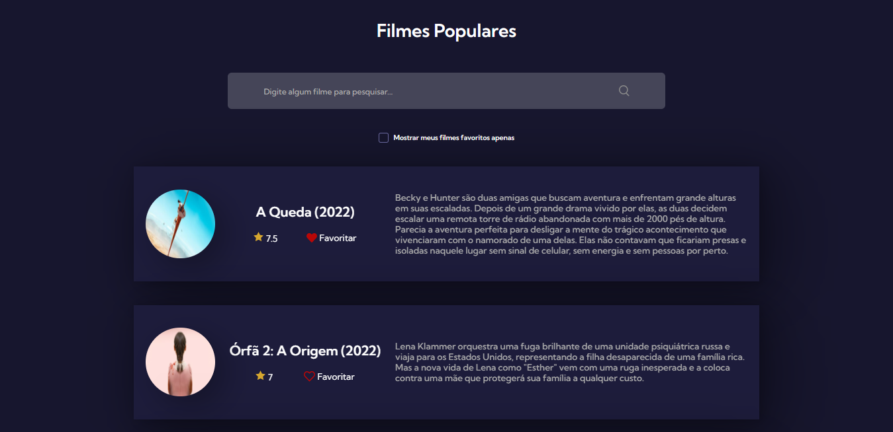

# Projeto Filmes-Populares
Projeto filmes populares com consumo da The Movie DataBase API do #7DaysOfCode JavasScript da Alura. 

<strong>Objetivos:</strong> 

- Consumir uma API de listagem de filmes The Movie DataBase. 
- Implementar a funcionalidade de favoritar/desfavoritar um filme.
- Armazenar os filmes favoritos no localStorage.

## 💻 Layout  

### Web

  

### Mobile

  

 ## 🔧 Tecnologias 

As tecnologias usadas foram: 
* HTML
* CSS
* JavaScript
